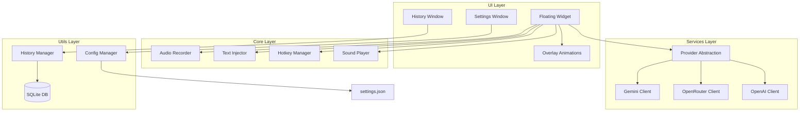

# Design Document: Gemini Voice Writer v2

## Overview

Gemini Voice Writer v2 — это полностью переработанное десктопное приложение для голосового ввода текста с AI-транскрипцией. Приложение построено на PyQt6 с асинхронной архитектурой, обеспечивающей отзывчивый UI. Поддерживает три AI-провайдера (Gemini, OpenRouter, OpenAI), хранит историю в SQLite, и автоматически вводит текст в активное окно.

## Architecture



## Components and Interfaces

### 1. UI Components

#### FloatingWidget (ui/floating_widget.py)
Главный виджет приложения — компактная плавающая панель.

```python
class FloatingWidget(QWidget):
    """Floating always-on-top widget with Gemini theme."""
    
    # Signals
    recording_started = pyqtSignal()
    recording_stopped = pyqtSignal()
    settings_requested = pyqtSignal()
    
    def __init__(self):
        """Initialize widget with Gemini theme styling."""
        
    def set_state(self, state: WidgetState) -> None:
        """Update widget visual state (IDLE, RECORDING, PROCESSING, SUCCESS, ERROR)."""
        
    def show_stats(self, duration: float, cost: float) -> None:
        """Display transcription statistics."""
        
    def save_position(self) -> None:
        """Persist current position to config."""
        
    def restore_position(self) -> None:
        """Restore position from config."""
```

#### SettingsWindow (ui/settings_window.py)
Окно настроек с вкладками.

```python
class SettingsWindow(QDialog):
    """Settings dialog with tabbed interface."""
    
    settings_saved = pyqtSignal(dict)
    
    def __init__(self, config_manager: ConfigManager):
        """Initialize with current settings."""
        
    def get_settings(self) -> dict:
        """Return current settings from UI."""
        
    def validate_api_key(self, provider: str, key: str) -> bool:
        """Validate API key format."""
```

#### HistoryWindow (ui/history_window.py)
Окно истории транскрипций.

```python
class HistoryWindow(QDialog):
    """History viewer with search and pagination."""
    
    def __init__(self, history_manager: HistoryManager):
        """Initialize history view."""
        
    def load_page(self, page: int) -> None:
        """Load specific page of history."""
        
    def search(self, query: str, filters: dict) -> None:
        """Search history with filters."""
```

#### AnimationOverlay (ui/animations.py)
Анимации состояний.

```python
class AnimationOverlay(QWidget):
    """Animated overlay for recording/processing states."""
    
    def show_recording_animation(self) -> None:
        """Display pulsing waveform with sparkles."""
        
    def show_processing_animation(self) -> None:
        """Display spinning loader."""
        
    def show_success_animation(self, stats: str = "") -> None:
        """Display success checkmark."""
        
    def show_error_animation(self, message: str) -> None:
        """Display error indicator."""
```

### 2. Core Components

#### AudioRecorder (core/audio_recorder.py)
Асинхронная запись аудио.

```python
class AudioRecorder:
    """Non-blocking audio recorder using sounddevice."""
    
    # Signals (via QObject wrapper)
    recording_started = pyqtSignal()
    recording_finished = pyqtSignal(str, float)  # filepath, duration
    error_occurred = pyqtSignal(str)
    
    def __init__(self, sample_rate: int = 16000, channels: int = 1):
        """Initialize recorder with audio settings."""
        
    def start(self) -> None:
        """Start recording in background thread."""
        
    def stop(self) -> tuple[str, float]:
        """Stop recording and return (filepath, duration)."""
        
    def get_devices(self) -> list[dict]:
        """List available audio input devices."""
        
    def set_device(self, device_id: int) -> None:
        """Set active input device."""
```

#### TextInjector (core/text_injector.py)
Ввод текста в активное окно.

```python
class TextInjector:
    """Simulates keyboard input to type text."""
    
    def __init__(self, typing_speed: int = 50):
        """Initialize with typing speed (chars per second)."""
        
    def inject(self, text: str) -> bool:
        """Type text into active window. Returns success status."""
        
    def copy_to_clipboard(self, text: str) -> None:
        """Copy text to clipboard as fallback."""
        
    def paste_from_clipboard(self) -> None:
        """Simulate Ctrl+V."""
```

#### HotkeyManager (core/hotkey_manager.py)
Управление глобальными горячими клавишами.

```python
class HotkeyManager:
    """System-wide hotkey registration and handling."""
    
    hotkey_pressed = pyqtSignal()
    hotkey_released = pyqtSignal()
    
    def __init__(self, mode: str = "toggle"):
        """Initialize with mode ('toggle' or 'hold')."""
        
    def register(self, hotkey: str) -> bool:
        """Register hotkey. Returns success status."""
        
    def unregister(self) -> None:
        """Unregister current hotkey."""
        
    def set_mode(self, mode: str) -> None:
        """Set recording mode ('toggle' or 'hold')."""
        
    def validate_hotkey(self, hotkey: str) -> tuple[bool, str]:
        """Validate hotkey string. Returns (valid, error_message)."""
```

#### SoundPlayer (core/sound_player.py)
Асинхронное воспроизведение звуков.

```python
class SoundPlayer:
    """Non-blocking sound playback."""
    
    def __init__(self, sounds_dir: str):
        """Initialize with sounds directory path."""
        
    def play(self, sound_name: str) -> None:
        """Play sound asynchronously. Silently fails if disabled or missing."""
        
    def set_enabled(self, enabled: bool) -> None:
        """Enable/disable sound playback."""
```

### 3. Services Layer

#### TranscriptionProvider (services/base.py)
Абстрактный базовый класс для провайдеров.

```python
from abc import ABC, abstractmethod

class TranscriptionProvider(ABC):
    """Abstract base class for transcription providers."""
    
    @abstractmethod
    def transcribe(self, audio_path: str) -> TranscriptionResult:
        """Transcribe audio file. Returns TranscriptionResult."""
        pass
    
    @abstractmethod
    def validate_api_key(self, api_key: str) -> bool:
        """Validate API key format."""
        pass
    
    @abstractmethod
    def get_models(self) -> list[dict]:
        """Return available models for this provider."""
        pass

@dataclass
class TranscriptionResult:
    text: str
    duration: float
    cost: float
    model: str
    provider: str
    raw_response: dict
```

#### GeminiProvider (services/gemini_provider.py)
```python
class GeminiProvider(TranscriptionProvider):
    """Google Gemini transcription provider."""
    
    def __init__(self, api_key: str, model: str = "gemini-2.5-flash"):
        """Initialize with API key and model."""
        
    def transcribe(self, audio_path: str) -> TranscriptionResult:
        """Transcribe using Gemini API."""
```

#### OpenRouterProvider (services/openrouter_provider.py)
```python
class OpenRouterProvider(TranscriptionProvider):
    """OpenRouter transcription provider (OpenAI-compatible)."""
    
    def __init__(self, api_key: str, model: str = "openai/whisper-large-v3"):
        """Initialize with API key and model."""
```

#### OpenAIProvider (services/openai_provider.py)
```python
class OpenAIProvider(TranscriptionProvider):
    """OpenAI Whisper transcription provider."""
    
    def __init__(self, api_key: str, model: str = "whisper-1"):
        """Initialize with API key and model."""
```

#### ProviderFactory (services/factory.py)
```python
class ProviderFactory:
    """Factory for creating transcription providers."""
    
    @staticmethod
    def create(provider_name: str, api_key: str, model: str) -> TranscriptionProvider:
        """Create provider instance by name."""
```

### 4. Utils Layer

#### ConfigManager (utils/config_manager.py)
```python
class ConfigManager:
    """Manages application configuration persistence."""
    
    def __init__(self, config_path: str = None):
        """Initialize with config file path."""
        
    def load(self) -> dict:
        """Load settings from JSON file."""
        
    def save(self, settings: dict) -> None:
        """Save settings to JSON file."""
        
    def get(self, key: str, default: Any = None) -> Any:
        """Get setting value by key."""
        
    def set(self, key: str, value: Any) -> None:
        """Set setting value."""
```

#### HistoryManager (utils/history_manager.py)
```python
class HistoryManager:
    """Manages transcription history in SQLite."""
    
    def __init__(self, db_path: str = None):
        """Initialize database connection."""
        
    def add(self, record: TranscriptionResult) -> int:
        """Add transcription record. Returns record ID."""
        
    def get_page(self, page: int, per_page: int = 20) -> list[dict]:
        """Get paginated history."""
        
    def search(self, query: str, filters: dict = None) -> list[dict]:
        """Search history with optional filters."""
        
    def delete(self, record_id: int) -> bool:
        """Delete record by ID."""
        
    def get_total_count(self) -> int:
        """Get total number of records."""
```

## Data Models

### Settings Schema (settings.json)
```json
{
  "provider": "gemini",
  "api_keys": {
    "gemini": "...",
    "openrouter": "...",
    "openai": "..."
  },
  "model": "gemini-2.5-flash",
  "hotkey": "ctrl+alt",
  "hotkey_mode": "toggle",
  "audio_device": null,
  "output_mode": "inject",
  "typing_speed": 50,
  "sound_enabled": true,
  "show_stats": true,
  "widget_position": {"x": 100, "y": 50},
  "theme": "gemini"
}
```

### History Database Schema (SQLite)
```sql
CREATE TABLE transcriptions (
    id INTEGER PRIMARY KEY AUTOINCREMENT,
    timestamp DATETIME DEFAULT CURRENT_TIMESTAMP,
    duration REAL NOT NULL,
    provider TEXT NOT NULL,
    model TEXT NOT NULL,
    cost REAL DEFAULT 0,
    text TEXT NOT NULL,
    audio_path TEXT
);

CREATE INDEX idx_timestamp ON transcriptions(timestamp DESC);
CREATE INDEX idx_provider ON transcriptions(provider);
```

### TranscriptionResult Dataclass
```python
@dataclass
class TranscriptionResult:
    text: str
    duration: float
    cost: float
    model: str
    provider: str
    timestamp: datetime = field(default_factory=datetime.now)
    raw_response: dict = field(default_factory=dict)
```

## Correctness Properties

*A property is a characteristic or behavior that should hold true across all valid executions of a system-essentially, a formal statement about what the system should do. Properties serve as the bridge between human-readable specifications and machine-verifiable correctness guarantees.*

Based on the prework analysis, the following correctness properties have been identified:

### Property 1: Widget Position Persistence Round-Trip
*For any* valid screen position (x, y), saving the widget position and then loading it SHALL return the same position coordinates.
**Validates: Requirements 1.3**

### Property 2: Audio Recording Thread Isolation
*For any* recording session, the audio capture SHALL execute in a separate thread, and the main UI thread SHALL remain responsive (measurable by UI event processing time < 100ms).
**Validates: Requirements 3.3**

### Property 3: WAV File Format Consistency
*For any* completed recording, the saved WAV file SHALL have exactly 16kHz sample rate, 1 channel (mono), and 16-bit sample width.
**Validates: Requirements 3.4**

### Property 4: Toggle Mode State Machine
*For any* sequence of hotkey presses in Toggle Mode, the recording state SHALL alternate between RECORDING and IDLE with each press.
**Validates: Requirements 4.1**

### Property 5: Hold Mode Recording Duration
*For any* hotkey hold duration D in Hold-to-Record Mode, the recording duration SHALL be approximately equal to D (within 200ms tolerance).
**Validates: Requirements 4.2**

### Property 6: Hotkey Validation
*For any* hotkey string, the validation function SHALL return true only for valid modifier+key combinations (e.g., "ctrl+alt+a", "shift+f1") and false for invalid strings.
**Validates: Requirements 4.3**

### Property 7: Provider Factory Correctness
*For any* valid provider name ("gemini", "openrouter", "openai"), the ProviderFactory SHALL return an instance of the corresponding provider class.
**Validates: Requirements 5.1, 5.2, 5.3**

### Property 8: Async Transcription Non-Blocking
*For any* transcription request, the API call SHALL execute in a background thread, and the UI thread SHALL not block during the request.
**Validates: Requirements 5.4**

### Property 9: Error Message Formatting
*For any* API error with code and message, the formatted user-friendly error SHALL contain both the error code and a suggestion for resolution.
**Validates: Requirements 5.6**

### Property 10: Clipboard Round-Trip
*For any* text string, copying to clipboard and reading back SHALL return the identical string.
**Validates: Requirements 6.2**

### Property 11: Special Character Injection
*For any* text containing special characters (unicode, newlines, tabs), the Text Injector SHALL correctly handle all characters without corruption.
**Validates: Requirements 6.5**

### Property 12: Settings Persistence Round-Trip
*For any* valid settings dictionary, saving to JSON and loading back SHALL return an equivalent dictionary.
**Validates: Requirements 7.2, 7.3**

### Property 13: API Key Validation Format
*For any* API key string, the validation function SHALL correctly identify valid key formats for each provider (Gemini: starts with "AI", OpenAI: starts with "sk-", OpenRouter: alphanumeric).
**Validates: Requirements 7.5**

### Property 14: History Storage Round-Trip
*For any* TranscriptionResult, storing in SQLite and retrieving by ID SHALL return a record with identical text, duration, provider, model, and cost values.
**Validates: Requirements 8.1**

### Property 15: History Ordering
*For any* set of transcription records, the history query SHALL return them in reverse chronological order (newest first).
**Validates: Requirements 8.2**

### Property 16: History Deletion Consistency
*For any* existing record ID, deletion SHALL remove exactly that record, and subsequent queries SHALL not return it.
**Validates: Requirements 8.4**

### Property 17: History Search Filtering
*For any* search query and filter combination, all returned results SHALL match the query text AND satisfy all filter conditions.
**Validates: Requirements 8.5**

### Property 18: Sound Playback Non-Blocking
*For any* sound playback request, the playback SHALL execute asynchronously and return control to the caller within 10ms.
**Validates: Requirements 9.2**

### Property 19: Sound Disabled Behavior
*For any* sound playback request when sounds are disabled, the system SHALL not attempt playback and SHALL not produce errors.
**Validates: Requirements 9.3**

## Error Handling

### Error Categories

1. **API Errors**
   - Invalid API key → Display "Invalid API key. Please check your settings."
   - Rate limit exceeded → Display "Rate limit exceeded. Please wait and try again."
   - Network error → Display "Network error. Check your internet connection."
   - Region restriction → Display "Region restricted. Consider using a VPN."

2. **Audio Errors**
   - Device unavailable → Fall back to default device, notify user
   - Recording failed → Display error, allow retry
   - File save failed → Display error with path

3. **Hotkey Errors**
   - Registration failed → Display warning, suggest alternative
   - Conflict detected → Display warning with conflicting app name

4. **Database Errors**
   - Connection failed → Create new database, log error
   - Query failed → Log error, return empty result

### Error Logging

All errors are logged to `%APPDATA%/GeminiVoiceWriter/error.log` with:
- Timestamp
- Error type
- Stack trace
- System info (OS version, Python version)

## Testing Strategy

### Unit Testing Framework
- **Framework:** pytest
- **Coverage target:** 80% for core and services layers

### Property-Based Testing Framework
- **Framework:** Hypothesis (Python PBT library)
- **Minimum iterations:** 100 per property test
- **Tag format:** `# **Feature: gemini-voice-writer-v2, Property {N}: {description}**`

### Test Categories

1. **Unit Tests**
   - ConfigManager: load/save operations
   - HistoryManager: CRUD operations
   - HotkeyManager: validation logic
   - Provider classes: API key validation, model listing
   - TextInjector: special character handling

2. **Property-Based Tests**
   - Settings round-trip (Property 12)
   - History round-trip (Property 14)
   - Widget position round-trip (Property 1)
   - WAV format consistency (Property 3)
   - Hotkey validation (Property 6)
   - Provider factory (Property 7)
   - Error message formatting (Property 9)
   - History ordering (Property 15)
   - History search filtering (Property 17)

3. **Integration Tests**
   - Full recording → transcription → injection flow
   - Settings persistence across app restarts
   - History pagination and search

### Test File Structure
```
tests/
├── unit/
│   ├── test_config_manager.py
│   ├── test_history_manager.py
│   ├── test_hotkey_manager.py
│   ├── test_providers.py
│   └── test_text_injector.py
├── property/
│   ├── test_settings_roundtrip.py
│   ├── test_history_roundtrip.py
│   ├── test_hotkey_validation.py
│   └── test_provider_factory.py
└── integration/
    ├── test_recording_flow.py
    └── test_settings_persistence.py
```
